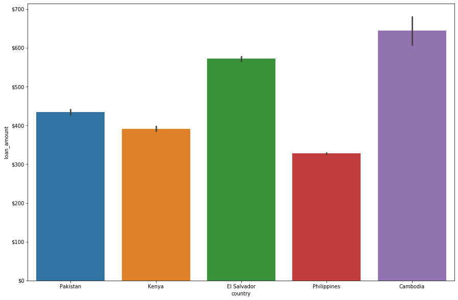
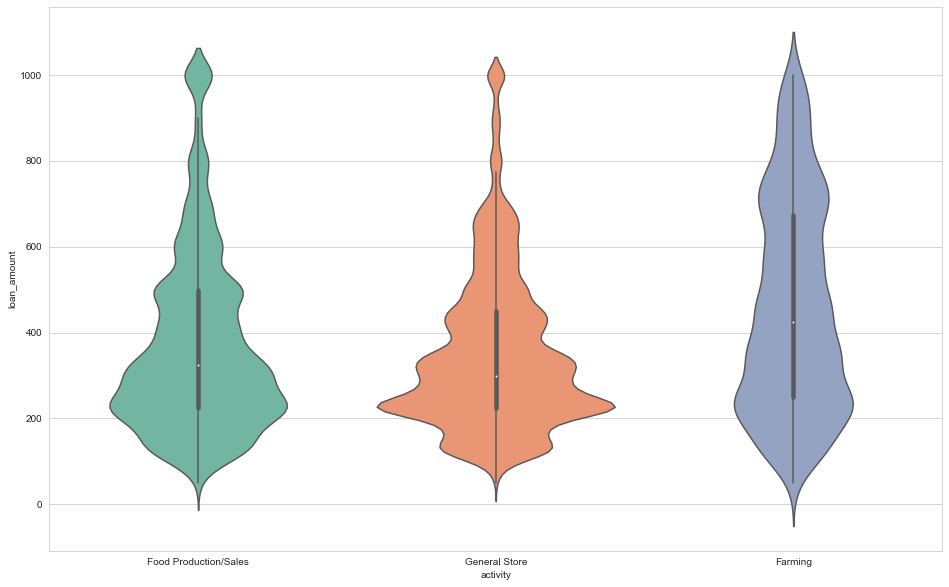

# Visualizing loans awarded by Kiva

In this project I have visualized insights using a dataset from <a href = "https://www.kaggle.com/fkosmowski/kivadhsv1" target = "_blank">Kaggle</a>. The dataset contains information about loans awarded by the non-profit <a href = "https://www.kiva.org/" target = "_blank">Kiva</a>. 

Using Seaborn, I have explored the average loan amount by country using aggregated bar charts. Also visualized the distribution of loan amounts by project type and gender using box plots and violin plots.


## Step 1: Import Necessary Python Modules


```python
from matplotlib import pyplot as plt
import pandas as pd
import seaborn as sns
```

## Step 2: Ingest The Data
Load **kiva_data.csv** into a DataFrame called `df`.


```python
df = pd.read_csv('kiva_data.csv')
```

## Step 3: Examine The Data


### Overview of the dataset:

Each entry (row) in the dataset represents a loan that Kiva awarded to a particular project. The `loan_amount` column shows the amount (in U.S. dollars) awarded to the project. The `activity` column has the category type that the project falls under. The `country` column is the country where the project is located. The `gender` column represents the gender of the primary person who applied for the loan. 


```python
df.head(25)
```


<div>
<style scoped>
    .dataframe tbody tr th:only-of-type {
        vertical-align: middle;
    }

    .dataframe tbody tr th {
        vertical-align: top;
    }

    .dataframe thead th {
        text-align: right;
    }
</style>
<table border="1" class="dataframe">
  <thead>
    <tr style="text-align: right;">
      <th></th>
      <th>loan_amount</th>
      <th>activity</th>
      <th>country</th>
      <th>gender</th>
    </tr>
  </thead>
  <tbody>
    <tr>
      <td>0</td>
      <td>625</td>
      <td>Food Production/Sales</td>
      <td>Pakistan</td>
      <td>female</td>
    </tr>
    <tr>
      <td>1</td>
      <td>250</td>
      <td>Food Production/Sales</td>
      <td>Pakistan</td>
      <td>female</td>
    </tr>
    <tr>
      <td>2</td>
      <td>400</td>
      <td>Food Production/Sales</td>
      <td>Pakistan</td>
      <td>female</td>
    </tr>
    <tr>
      <td>3</td>
      <td>400</td>
      <td>Food Production/Sales</td>
      <td>Pakistan</td>
      <td>female</td>
    </tr>
    <tr>
      <td>4</td>
      <td>500</td>
      <td>Food Production/Sales</td>
      <td>Pakistan</td>
      <td>female</td>
    </tr>
    <tr>
      <td>5</td>
      <td>500</td>
      <td>Food Production/Sales</td>
      <td>Pakistan</td>
      <td>female</td>
    </tr>
    <tr>
      <td>6</td>
      <td>400</td>
      <td>Food Production/Sales</td>
      <td>Pakistan</td>
      <td>female</td>
    </tr>
    <tr>
      <td>7</td>
      <td>500</td>
      <td>Food Production/Sales</td>
      <td>Pakistan</td>
      <td>female</td>
    </tr>
    <tr>
      <td>8</td>
      <td>400</td>
      <td>Food Production/Sales</td>
      <td>Pakistan</td>
      <td>female</td>
    </tr>
    <tr>
      <td>9</td>
      <td>450</td>
      <td>Food Production/Sales</td>
      <td>Pakistan</td>
      <td>female</td>
    </tr>
    <tr>
      <td>10</td>
      <td>250</td>
      <td>Food Production/Sales</td>
      <td>Pakistan</td>
      <td>female</td>
    </tr>
    <tr>
      <td>11</td>
      <td>300</td>
      <td>Food Production/Sales</td>
      <td>Pakistan</td>
      <td>female</td>
    </tr>
    <tr>
      <td>12</td>
      <td>275</td>
      <td>Food Production/Sales</td>
      <td>Pakistan</td>
      <td>female</td>
    </tr>
    <tr>
      <td>13</td>
      <td>425</td>
      <td>Food Production/Sales</td>
      <td>Pakistan</td>
      <td>female</td>
    </tr>
    <tr>
      <td>14</td>
      <td>425</td>
      <td>Food Production/Sales</td>
      <td>Pakistan</td>
      <td>female</td>
    </tr>
    <tr>
      <td>15</td>
      <td>475</td>
      <td>Food Production/Sales</td>
      <td>Pakistan</td>
      <td>female</td>
    </tr>
    <tr>
      <td>16</td>
      <td>225</td>
      <td>Food Production/Sales</td>
      <td>Pakistan</td>
      <td>female</td>
    </tr>
    <tr>
      <td>17</td>
      <td>475</td>
      <td>Food Production/Sales</td>
      <td>Pakistan</td>
      <td>female</td>
    </tr>
    <tr>
      <td>18</td>
      <td>525</td>
      <td>Food Production/Sales</td>
      <td>Pakistan</td>
      <td>female</td>
    </tr>
    <tr>
      <td>19</td>
      <td>425</td>
      <td>Food Production/Sales</td>
      <td>Pakistan</td>
      <td>female</td>
    </tr>
    <tr>
      <td>20</td>
      <td>475</td>
      <td>Food Production/Sales</td>
      <td>Pakistan</td>
      <td>female</td>
    </tr>
    <tr>
      <td>21</td>
      <td>550</td>
      <td>Food Production/Sales</td>
      <td>Pakistan</td>
      <td>female</td>
    </tr>
    <tr>
      <td>22</td>
      <td>450</td>
      <td>Food Production/Sales</td>
      <td>Pakistan</td>
      <td>female</td>
    </tr>
    <tr>
      <td>23</td>
      <td>250</td>
      <td>Food Production/Sales</td>
      <td>Pakistan</td>
      <td>female</td>
    </tr>
    <tr>
      <td>24</td>
      <td>600</td>
      <td>Food Production/Sales</td>
      <td>Pakistan</td>
      <td>female</td>
    </tr>
  </tbody>
</table>
</div>


## Step 4: Bar Charts

Bar plot using Seaborn to visualize the average size of Kiva loans given to projects, by country.


```python

f, ax = plt.subplots(figsize=(15, 10))

sns.barplot(data = df,
            x = "country",
            y = "loan_amount")
```


 


### Adding `$` units


```python
import matplotlib.ticker as mtick

# Creates the figure
f, ax = plt.subplots(figsize=(15, 10))

# Plot the data
sns.barplot(data=df, x="country", y = "loan_amount")

# Use part of the code above to format the y-axis ticks below this line
fmt = '${x:,.0f}'
tick = mtick.StrMethodFormatter(fmt)
ax.yaxis.set_major_formatter(tick) 


```





## Step 5: Learn More By Using `hue` In Your Visualization

Visualized even more data on one bar plot by visualizing the loan amount by country, and "nesting" by gender. Added the `hue` parameter to `sns.barplot()` and set it so that the visualization includes the nested category of gender.


```python

f, ax = plt.subplots(figsize=(15, 10))

sns.barplot(data=df, x="country", y="loan_amount")

fmt = '${x:,.0f}'
tick = mtick.StrMethodFormatter(fmt)
ax.yaxis.set_major_formatter(tick)
```


#### Reflection Questions

On average, do female or male recipients receive larger loans from Kiva?


```python
sns.barplot(data=df, x="country", y="loan_amount", hue = "gender")
```


    <matplotlib.axes._subplots.AxesSubplot at 0x1c0ee26b288>


Which country has the *least* disparity in loan amounts awarded by gender?


    El Salvador
    

Based on the data, what kind of recommendations can you make to Kiva about the loans they give?


    Reduce the Disparity between male and female and offer equal loans irrespective of gender
    

## Step 6: Styling


```python


sns.set_palette("Accent")

# Set style
sns.set_style("whitegrid")

# Create figure and axes
plt.figure(figsize=(15, 10))

# Add title
ax.set_title("Kiva Loan amounts to Various Countries")

# Use Seaborn to create the bar plot
sns.barplot(data = df, x = "country", y = "loan_amount", hue = "gender")

```


## Step 7: Box Plots With Kiva Data

So far I have visualized the average size of loans by country using bar charts; now I'm going to make a box plot to compare the distribution of loans by country.


```python
plt.figure(figsize=(16, 10))

# Set color palette
sns.set_palette("Dark2")

# Set style
sns.set_style("whitegrid")

# Add a title
ax.set_title("Loan Amounts")

sns.boxplot(data = df, x = "country", y = "loan_amount")

```


    <matplotlib.axes._subplots.AxesSubplot at 0x1c0ef5c3d48>


#### Reflection Questions

Which country's box has the widest distribution?


    Kenya
    

In which country would you be most likely to receive the largest loan amount?


    Cambodia
    

## Step 8: Box Plot by Activity

Instead of visualizing the loan amount by *country*, used `sns.boxplot()` to plot the loan amount by *activity*.


```python
plt.figure(figsize=(16, 10))


plt.figure(figsize=(16, 10))

# Set color palette
sns.set_palette("Set2")

# Set style
sns.set_style("whitegrid")

# Add a title
ax.set_title("Loan Amounts")

sns.boxplot(data = df, x = "activity", y = "loan_amount")
```


    <matplotlib.axes._subplots.AxesSubplot at 0x1c0ef31ccc8>


    <Figure size 1152x720 with 0 Axes>


#### Reflection Questions

What does this visualization reveal that previous ones did not?


    We can see that Farming has been given priority to lend the loan amount and the boxplot has been plotted based on activity
    

## Step 9: Violin Plots


```python
plt.figure(figsize=(16, 10))

sns.violinplot(data=df, x="activity", y="loan_amount")
```


    <matplotlib.axes._subplots.AxesSubplot at 0x1c0f0aeb9c8>





### Create a violin plot that visualizes the distribution of loan amount by country.
Previously, created a violin plot and plotted the data by _activity_. This time, I have created a violin plot that plots the data by _country_.


```python
plt.figure(figsize=(16, 10))
sns.violinplot(data=df, x="country", y="loan_amount")
```


    <matplotlib.axes._subplots.AxesSubplot at 0x1c0f0b1d188>


## Step 10: Split Violin Plots


```python
# Some styling (feel free to modify)
sns.set_palette("Spectral")
plt.figure(figsize=(18, 12))
sns.violinplot(data=df, x="country", y="loan_amount", hue = "gender", split = True)
```


    <matplotlib.axes._subplots.AxesSubplot at 0x1c0f1002f08>


#### Reflection Questions

What does this visualization reveal about the distribution of loan amounts within countries by gender?


    We can observe that for countries like 'Pakistan' Males are provided with higher loan amount and similarily for 'Cambodia'
    whereas in El Salvador the distribution of loan_amount is even between male and female. 
    
